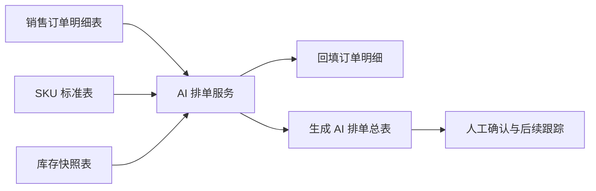

# AI Scheduling Project

一个面向销售订单履约场景的 AI 排单系统。系统基于 FastAPI 构建，直接对接飞书多维表格，自动读取销售订单明细、SKU 标准数据和库存快照，计算库存缺口、预计到货日期和建议发货日期，并将结果回写到 AI 排单总表。

项目适合用于订单量持续变化、SKU 多、库存状态需要频繁刷新、人工排单容易遗漏或重复的业务场景。

## 核心能力

- 飞书多维表格集成：读取销售订单明细表、SKU 标准表、库存快照表，并回写排单结果。
- 库存可用量计算：按 SKU 匹配库存，计算库存可用量、缺口数量和库存状态。
- 缺货 ETA 推算：缺货 SKU 按标准生产周期计算预计到货日期；缺少标准周期时按新产品兜底周期处理。
- AI 排单总表生成：按合同编号聚合订单，输出项目类型、SKU 数量、缺货 SKU 数、缺货列表、整体状态和建议发货日期。
- 人工确认保护：已有效人工确认的订单保留原排单结果，并继续占用库存，避免 AI 重算覆盖人工决策。
- 工作日排期：发货日期自动剔除周六、周日，所有建议发货时间都会顺延到工作日。
- 产能限制：对非锁单、非特殊订单应用每日产能限制，超出产能的订单自动顺延。
- Upsert 写回：AI 排单总表按合同编号更新或新增，避免重复追加同一订单。
- 新增订单保护：本次加载到的新订单会参与汇总排单，即使飞书回填后重读存在延迟，也不会漏排。
- 本地缓存：保存明细和汇总缓存，用于锁单保护与库存占用计算。

## 业务流程



系统执行一次排单时，会完成以下步骤：

1. 从飞书读取最新订单明细、SKU 标准和库存快照。
2. 校验核心字段是否存在。
3. 根据历史排单缓存识别有效人工确认订单，并计算锁单库存占用。
4. 按 SKU 匹配库存，回填库存可用量、缺口数量、库存状态和预计到货日期。
5. 按合同编号聚合明细，生成订单级排单结果。
6. 修正缺货 SKU 数、缺货 SKU 列表和建议发货日期。
7. 应用工作日规则和每日产能限制。
8. 将结果写回 AI 排单总表。

## 排单规则概览

### 库存判断

- 库存可用量 = 库存快照数量 - 已人工锁单占用数量。
- 合同数量小于等于库存可用量时，订单明细为有货。
- 合同数量大于库存可用量时，订单明细为缺货，并记录缺口数量。

### 缺货日期

- 优先使用 SKU 标准表中的标准生产周期。
- 查不到 SKU 或缺少标准生产周期时，按新产品兜底周期处理。
- 预计到货日期以库存快照最新日期或当前日期作为基准。
- 所有日期最终都会顺延到工作日。

### 订单级建议发货时间

- 无缺货订单排到最近工作日。
- 有缺货订单取缺货 SKU 中最晚预计到货日期，再顺延到工作日。
- 缺货但暂时没有有效预计到货日期时，使用兜底周期生成建议发货时间，确保订单进入 AI 排单总表。

### 人工确认

只有同时满足以下条件的订单才视为有效人工锁单：

- `是否人工确认` 为 `是`
- `人工确认发货时间` 是有效日期

有效人工锁单订单不会被 AI 覆盖，但会继续占用库存，影响后续订单的可用库存计算。新生成订单的 `是否人工确认` 默认固定为字符串 `否`。

## 数据表

### 销售订单明细表

必需字段：

- `合同编号`
- `合同数量`
- `SKU编码`

常用回填字段：

- `库存可用量`
- `缺口数量`
- `库存状态`
- `预计到货日期`
- `是否RB800`
- `排单批次号`

### SKU 标准表

必需字段：

- `产品编码SKU`
- `标准生产周期`

可选字段：

- `设备名称`
- `设备型号`
- `是否新产品`
- `是否自研`
- `是否外采`

### 库存快照表

必需字段：

- `库存日期`
- `SKU`
- `库存数量`

可选字段：

- `国网设备名称`
- `国网设备型号`
- `待采购出库`
- `在途数量`

### AI 排单总表

输出字段：

- `合同编号`
- `项目类型`
- `订单SKU总数`
- `订单总数量`
- `缺货SKU数`
- `缺货SKU列表`
- `整体状态`
- `AI建议发货时间`
- `排单批次号`
- `是否人工确认`
- `人工确认发货时间`

## 快速开始

### 1. 安装依赖

```bash
pip install -r requirements.txt
```

### 2. 配置环境变量

建议通过环境变量配置飞书应用信息和表 ID：

```bash
FEISHU_APP_ID=your_app_id
FEISHU_APP_SECRET=your_app_secret
BITABLE_APP_TOKEN=your_bitable_app_token

TABLE_ID_ITEMS=your_sales_order_detail_table_id
TABLE_ID_SKU=your_sku_standard_table_id
TABLE_ID_INV=your_inventory_snapshot_table_id
TABLE_ID_SUMMARY=your_summary_table_id
TABLE_ID_DETAIL=your_ai_schedule_table_id
```

### 3. 启动服务

```bash
python run.py
```

也可以直接启动 API 文件：

```bash
python scheduler_api.py
```

服务默认监听：

```text
http://localhost:8000
```

## API

### 手动触发排单

```http
POST /schedule
```

示例：

```bash
curl -X POST http://localhost:8000/schedule
```

返回内容包含排单结果、回填明细行数、顺延订单数等信息。

### 飞书 Webhook

```http
POST /webhook/feishu
```

用于接收飞书侧的数据变更通知，并触发排单流程。

## 本地缓存

系统会在 `cache/` 目录下保存运行过程中的本地缓存：

- `ai_schedule_detail.csv`：订单明细回填后的缓存
- `ai_schedule_summary.csv`：AI 排单总表缓存

缓存主要用于人工锁单保护、库存占用计算和本地调试。

## 技术栈

- Python
- FastAPI
- pandas
- httpx
- lark-oapi
- Uvicorn

## 适用场景

- 订单履约排期
- 多 SKU 库存缺口分析
- 生产或采购周期驱动的发货日期预测
- 飞书多维表格自动化运营
- 人工确认与自动排单混合管理

## 项目状态

当前版本聚焦于飞书多维表格中的订单排单自动化，已经覆盖库存回填、缺货分析、工作日排期、产能顺延、人工锁单保护和 AI 排单总表写回等核心流程。
